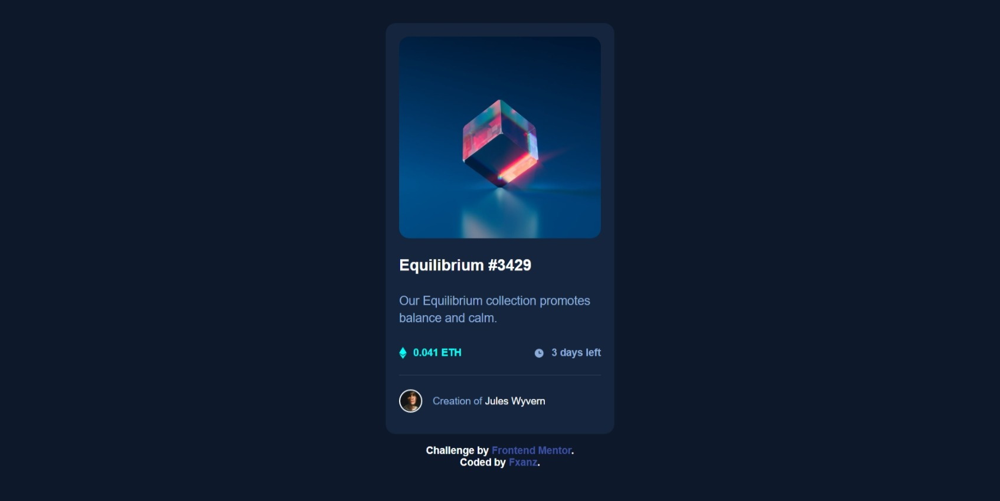

# Frontend Mentor - NFT preview card component solution

This is a solution to the [NFT preview card component challenge on Frontend Mentor](https://www.frontendmentor.io/challenges/nft-preview-card-component-SbdUL_w0U). Frontend Mentor challenges help you improve your coding skills by building realistic projects.

## Table of contents

- [Overview](#overview)
  - [The challenge](#the-challenge)
  - [Screenshot](#screenshot)
  - [Links](#links)
- [My process](#my-process)
  - [Built with](#built-with)
  - [What I learned](#what-i-learned)
  - [Continued development](#continued-development)
  - [Useful resources](#useful-resources)
- [Author](#author)
- [Acknowledgments](#acknowledgments)

## Overview

### The challenge

Users should be able to:

- View the optimal layout depending on their device's screen size
- See hover states for interactive elements

### Screenshot



### Links

- Solution URL: [My Solution](https://your-solution-url.com)
- Live Site URL: [Live Site](https://fxanz.github.io/Frontendmentor-NFT-Preview-Card-Component/)

## My process

### Built with

- Semantic HTML5 markup
- CSS custom properties
- Flexbox
- CSS Grid

### What I learned

knowing how to use the root css property

```css
:root {
  --White: hsl(0, 0%, 100%);
}
main {
  color: var(--white);
}
```

knowing how to show elements when hover in css

```css
.img-overlay {
  display: flex;
  align-items: center;
  justify-content: center;
  position: absolute;
  opacity: 0;
  border-radius: 15px;
  top: 0;
  width: 100%;
  height: 100%;
  background-color: hsl(178, 100%, 50%, 0.3);
  cursor: pointer;
  transition: 1s;
}

.img-overlay:hover {
  opacity: 1;
  transition: 1s;
}
```

### Continued development

learn more how to show object when hover and click in css

### Useful resources

- [hover states](https://github.com/correlucas/nft-preview-card) - This github help me on hover states for interactive elements

## Author

- Frontend Mentor - [@fxanz](https://www.frontendmentor.io/profile/fxanz)
- Twitter - [@IFxanz](https://twitter.com/IFxanz)

## Acknowledgments

Thanks for - [@correlucas](https://www.frontendmentor.io/profile/correlucas) - for giving good examples of hover state for interactive elements
